# DifferentialEvolution.jl

Small, reproducible Differential Evolution (DE) optimizer for continuous, bound-
constrained minimization. The implementation follows the classic DE/rand/1/bin
scheme with binomial crossover and bound clipping.

## Minimal example

```julia
using DifferentialEvolution
using Random

f(x) = sum(abs2, x)

lower = fill(-5.0, 5)
upper = fill(5.0, 5)

rng = MersenneTwister(42)
result = optimize(f, lower, upper; rng=rng, maxiters=200)

@show result.best_x
@show result.best_f
@show result.status
```

Parallel evaluation (generation-synchronous):

```julia
rng = MersenneTwister(42)
res_parallel = optimize(f, lower, upper; rng=rng, maxiters=200, parallel=true)
```

Algorithm selection (using the same `f`, `lower`, `upper`):

```julia
rng = MersenneTwister(42)
res_shade = optimize(f, lower, upper; rng=rng, algorithm=:shade, maxiters=200)

rng = MersenneTwister(42)
res_lshade = optimize(f, lower, upper; rng=rng, algorithm=:lshade, maxiters=200)

rng = MersenneTwister(42)
res_jso = optimize(f, lower, upper; rng=rng, algorithm=:jso, maxiters=200, pmax=0.25)
```

## 2D animation gallery

Grouped by objective function (2D).  
Algorithms shown: `BFGS`, `Nelder-Mead`, `DE`, `SHADE`.

### Sphere

| BFGS | Nelder-Mead | DE | SHADE |
| --- | --- | --- | --- |
| 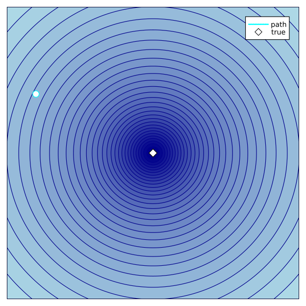 | 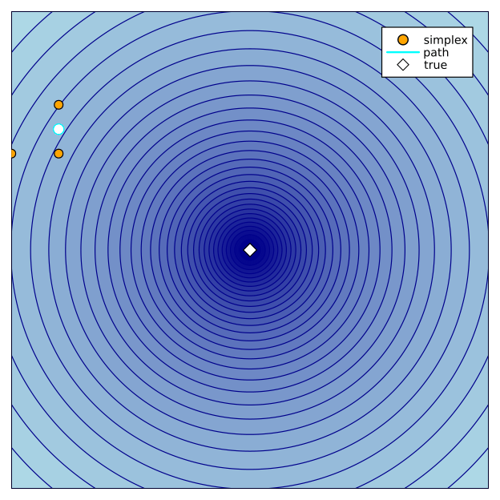 | 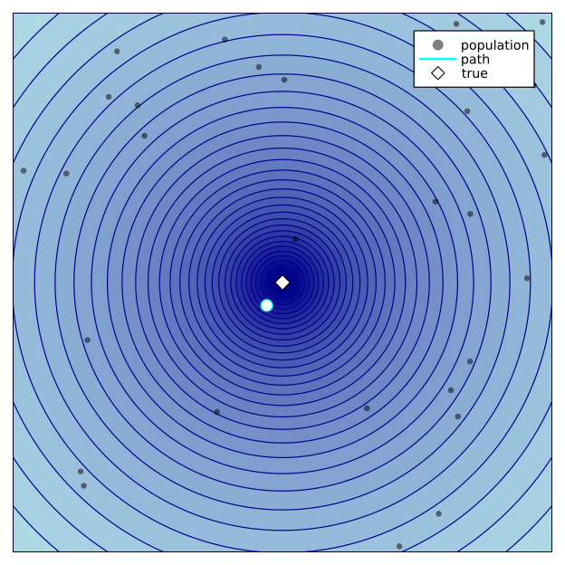 | 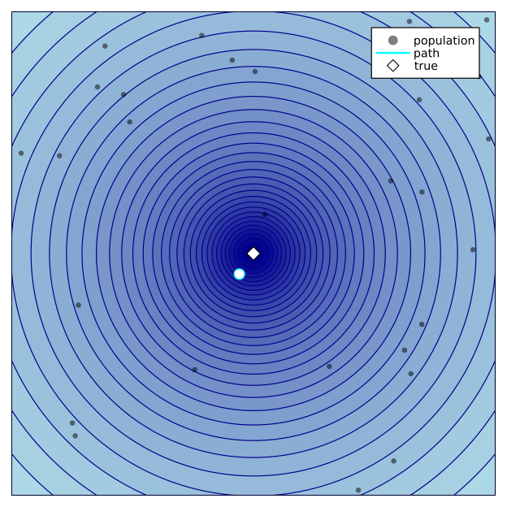 |

### Rastrigin

| BFGS | Nelder-Mead | DE | SHADE |
| --- | --- | --- | --- |
| 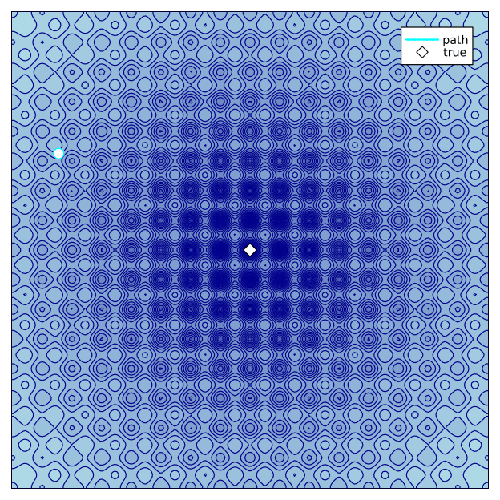 | 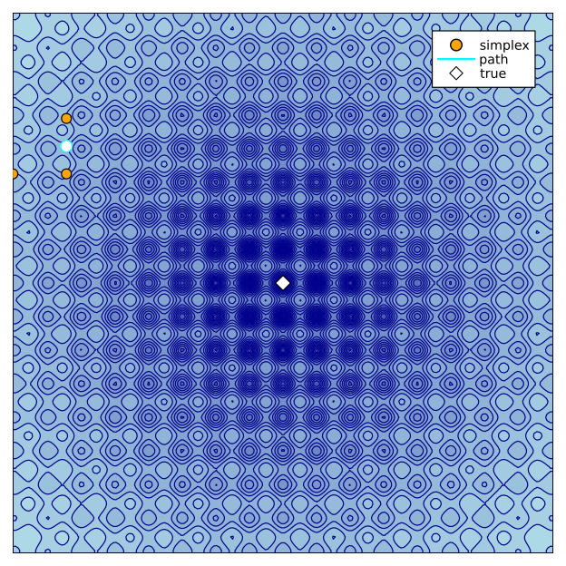 | 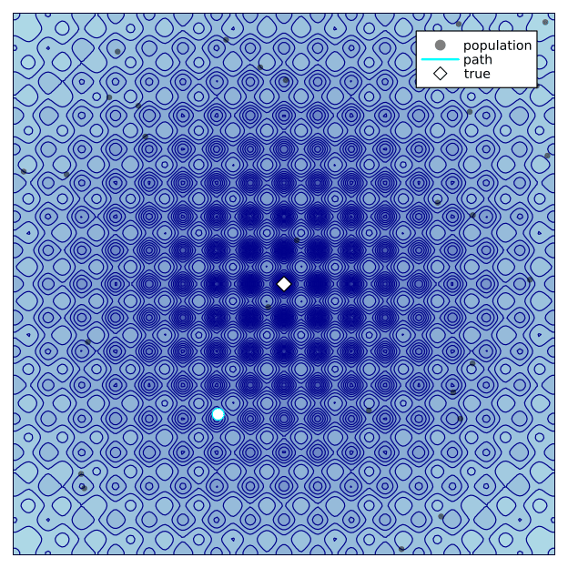 | 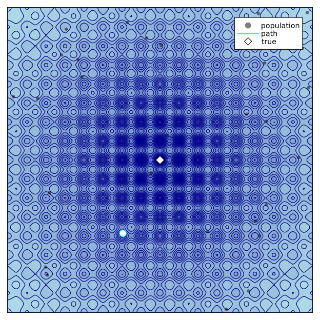 |

### Schwefel

| BFGS | Nelder-Mead | DE | SHADE |
| --- | --- | --- | --- |
| 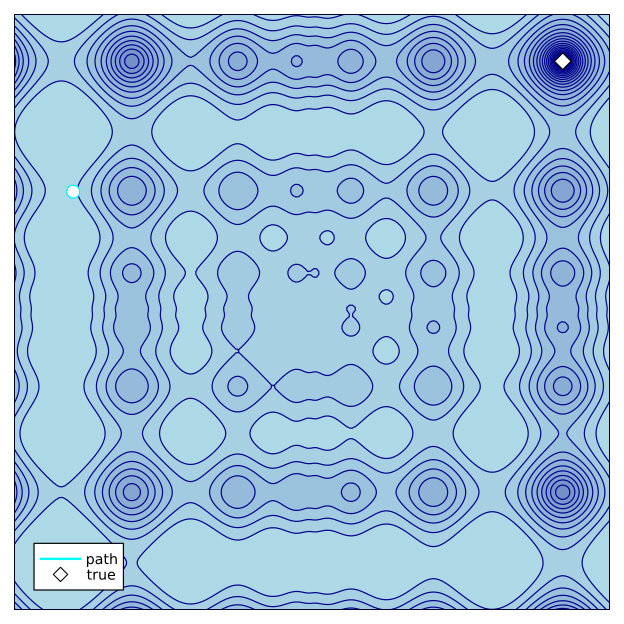 | 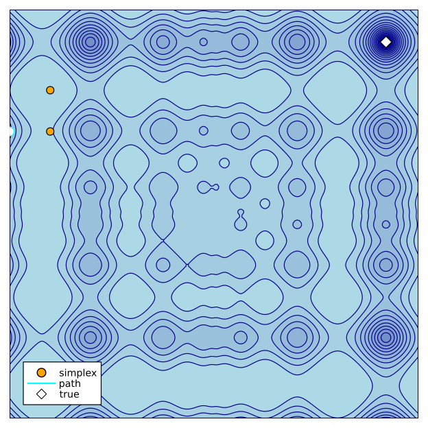 |  | 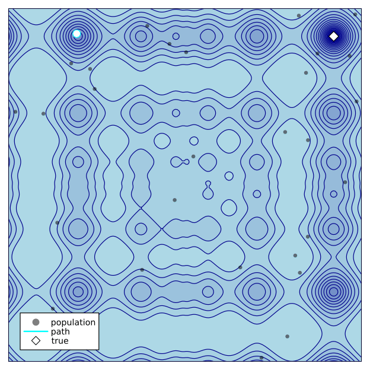 |

## API

```
optimize(f, lower, upper; rng, algorithm, popsize, maxiters, maxevals, F, CR, memory_size, pmax, target, history, parallel, local_refine, local_method, local_maxiters, local_tol, trace_history, job_id, message, message_every)
```

- `f`: objective function taking an `AbstractVector`
- `lower`, `upper`: vectors of bounds (same length, `lower[i] < upper[i]`)

Keywords:

- `rng` (required): random number generator used internally
- `algorithm`: `:de` (default), `:shade`, `:lshade`, or `:jso`
- `popsize`: population size (default `max(10*D, 4)`)
- `maxiters`: maximum number of iterations (default `1000`)
- `maxevals`: maximum number of objective evaluations (default `popsize * (maxiters + 1)`)
- `F`: mutation factor in `(0, 2]` (default `0.8`)
- `CR`: crossover probability in `[0, 1]` (default `0.9`)
- `memory_size`: history size for SHADE/L-SHADE (default `popsize`; for jSO default `5`)
- `pmax`: upper bound for p-best fraction in SHADE/L-SHADE/jSO (default `0.2`; jSO paper uses `0.25`)
- `target`: stop when `best_f <= target` (default `-Inf`; `NaN` is invalid)
- `history`: store best objective after each iteration (default `true`)
- `parallel`: evaluate a generation in parallel using threads (default `false`)
- `local_refine`: run a local refinement step after DE finishes (default `false`)
- `local_method`: local optimizer, `:nelder_mead` or `:lbfgs` (default `:nelder_mead`)
- `local_maxiters`: max iterations for local refinement (default `200`)
- `local_tol`: tolerance used by local refinement (default `1e-8`)
- `trace_history`: store per-generation and local-phase records in `result.trace` (default `false`)
- `job_id`: integer job identifier stored in trace rows (default `0`)
- `message`: print progress messages during optimization (default `false`)
- `message_every`: print every N generations when `message=true` (default `1`)

Notes:

- `F` and `CR` are used only when `algorithm=:de`.
- `algorithm=:shade` uses success-history based parameter adaptation.
- `algorithm=:lshade` extends SHADE with linear population size reduction
  (population shrinks linearly to 4 by the evaluation budget).
- `algorithm=:jso` is a jSO-style variant of iL-SHADE with weighted
  current-to-pbest mutation, linear population size reduction, and a
  linearly decreasing p schedule.
- `parallel=true` switches to a generation-synchronous update. Trials are
  generated from the same parent population and evaluated in parallel. Results
  can differ from the default asynchronous update but remain reproducible when
  `f` is deterministic.
- If `f` returns non-finite values (`NaN`/`Inf`) or a non-convertible type,
  the value is treated as `Inf` so the run continues safely.
- Local refinement starts from the DE best solution. If local optimization fails,
  the DE best solution is returned safely.
- With `message=true`, DE progress is printed as:
  `generation/current_maxiters`, evaluation count, best parameter, and best objective value.

Return value `Result` fields:

- `best_x`: best solution vector
- `best_f`: objective value at `best_x`
- `status`: final outcome, `:target_reached` or `:not_reached`
- `de_status`: DE-phase stop reason, `:target_reached`, `:maxiters`, `:maxevals`, or `:stopped`
- `evaluations`: total number of objective evaluations (DE + local if enabled)
- `iterations`: number of iterations executed
- `history`: best objective value after each iteration (empty when `history=false`)
- `de_best_x`, `de_best_f`: best solution/value from DE phase
- `local_best_x`, `local_best_f`: best solution/value from local phase
- `local_status`: `:disabled`, `:success`, `:failed`, or `:stopped`
- `de_evaluations`, `local_evaluations`, `total_evaluations`
- `elapsed_de_sec`, `elapsed_local_sec`, `elapsed_total_sec`
- `settings`: resolved run settings used for this run
- `trace`: list of `TraceRecord` rows (`generation`, `job_id`, `phase`, `best_x`, `best_f`, `evaluations`)

Compatibility note:
- `status` represents the final outcome after the full run (`:target_reached` or `:not_reached`).
- Use `de_status` for the DE-loop stop reason (`:target_reached`, `:maxiters`, `:maxevals`, or `:stopped`).

## Reproducibility

All randomness is controlled by the `rng` you pass in. Using the same seed yields
the same result:

```julia
rng1 = MersenneTwister(1234)
rng2 = MersenneTwister(1234)

res1 = optimize(f, lower, upper; rng=rng1, maxiters=100)
res2 = optimize(f, lower, upper; rng=rng2, maxiters=100)

@assert res1.best_x == res2.best_x
@assert res1.best_f == res2.best_f
```

## Parallel DE inside one run

Use `parallel=true` to evaluate one generation across threads.

- Update rule: generation-synchronous (all trials are created from the same parent population).
- Best use case: expensive deterministic objective evaluations.
- Reproducibility: same seed gives reproducible results when `f` is deterministic.
- Parallel mode can produce a different trajectory from serial mode (`parallel=false`) because parent updates are synchronized per generation.

```bash
JULIA_NUM_THREADS=8 julia --project=. -e '
using DifferentialEvolution, Random
f(x) = sum(abs2, x)
lower = fill(-5.0, 20)
upper = fill(5.0, 20)
rng = MersenneTwister(42)
res = optimize(f, lower, upper; rng=rng, parallel=true, maxevals=200000)
@show res.best_f res.status res.de_status
'
```

## Hybrid refinement (DE -> local)

When `local_refine=true`, local optimization starts from `de_best_x` after DE ends.

- `local_method=:lbfgs`: smooth objectives where gradients (autodiff) are usable.
- `local_method=:nelder_mead`: noisy or non-smooth objectives.
- Box bounds are respected through `Fminbox`.
- Safety rule: if local optimization fails, DE result is kept.
- Final selection: `best_f = min(de_best_f, local_best_f)`.

```julia
rng = MersenneTwister(42)
res_hybrid = optimize(
    f,
    lower,
    upper;
    rng=rng,
    algorithm=:shade,
    maxevals=200000,
    local_refine=true,
    local_method=:nelder_mead,
    local_maxiters=300,
    local_tol=1e-8,
)

@show res_hybrid.de_best_f
@show res_hybrid.local_best_f
@show res_hybrid.best_f
@show res_hybrid.status
@show res_hybrid.de_status
@show res_hybrid.local_status
```

## Trace CSV export example

```julia
rng = MersenneTwister(42)
res_trace = optimize(
    f,
    lower,
    upper;
    rng=rng,
    algorithm=:lshade,
    maxevals=200000,
    local_refine=true,
    local_method=:lbfgs,
    trace_history=true,
    job_id=42,
    message=true,
    message_every=10,
)

write_trace_csv(res_trace, "results/seed_42_trace.csv")
```

## Multi-seed runs and job arrays

`scripts/run_de.jl` uses `LOCAL_REFINE=false` by default (same as the library API default).

```bash
SEED=12 JULIA_NUM_THREADS=4 julia --project=. scripts/run_de.jl
```

Recommended flow:

```bash
# 1) Run one seed (1 job = 1 seed = 1 run)
SEED=12 OBJECTIVE=rastrigin DIM=20 ALGORITHM=shade MAXEVALS=200000 LOCAL_REFINE=true LOCAL_METHOD=nelder_mead julia --project=. scripts/run_de.jl

# 2) Optionally save per-generation trace CSV
SEED=12 TRACE_CSV=true julia --project=. scripts/run_de.jl

# 3) Optionally print progress every 10 generations
SEED=12 MESSAGE=true MESSAGE_EVERY=10 julia --project=. scripts/run_de.jl

# 4) Aggregate all runs
julia --project=. scripts/summarize_runs.jl --results_dir results --top_k 10
```

Output files:
- `results/seed_<seed>.json`: one run result (best values, statuses, evaluations, timings, settings).
- `results/seed_<seed>_trace.csv`: optional trace (`TRACE_CSV=true`).
- `results/summary.json`: aggregate report (`best_seed`, `top_k`, summary stats, skipped files).

Aggregation behavior:
- Malformed JSON, missing required fields, or invalid/non-finite `best_f` rows are skipped.
- Skipped rows are reported as warnings and recorded in `summary.json` under `skipped_runs`.

Slurm job array example:

```bash
sbatch --array=1-100%20 slurm/de_array.sbatch
```

The template maps `SLURM_ARRAY_TASK_ID` to `SEED` and writes results under `RESULTS_DIR`.

## Troubleshooting

- First run is slow: Julia package precompilation can dominate first execution.
- `status` vs `de_status`: use `status` for final success and `de_status` for DE stop reason.
- Local refinement failed: check `local_status`; the result safely falls back to DE best.
- Aggregation warnings: inspect `summary.json -> skipped_runs` to see invalid files and reasons.

## References

Source papers are referenced by link (PDF files are not bundled in this repository).

- R. Storn and K. Price (1997), *Differential Evolution - A Simple and Efficient Heuristic for global Optimization over Continuous Spaces*: <https://doi.org/10.1023/A:1008202821328>
- R. Tanabe and A. Fukunaga (2013), *Evaluating the performance of SHADE on CEC 2013 benchmark problems*: <https://scholar.google.com/scholar?q=Evaluating+the+performance+of+SHADE+on+CEC+2013+benchmark+problems>
- R. Tanabe and A. Fukunaga (2014), *Improving the search performance of SHADE using linear population size reduction*: <https://scholar.google.com/scholar?q=Improving+the+search+performance+of+SHADE+using+linear+population+size+reduction>
- J. Brest et al. (2017), *Single objective real-parameter optimization: Algorithm jSO*: <https://scholar.google.com/scholar?q=Single+objective+real-parameter+optimization+Algorithm+jSO>
- B. Zamuda et al. (2017), *Adaptive constraint handling and Success History Differential Evolution for CEC 2017*: <https://scholar.google.com/scholar?q=Adaptive+constraint+handling+and+Success+History+Differential+Evolution+for+CEC+2017+Constrained+Real-Parameter+Optimization>
- M. Viktorin et al. (2019), *Distance based parameter adaptation for Success-History based Differential Evolution*: <https://scholar.google.com/scholar?q=Distance+based+parameter+adaptation+for+Success-History+based+Differential+Evolution>
